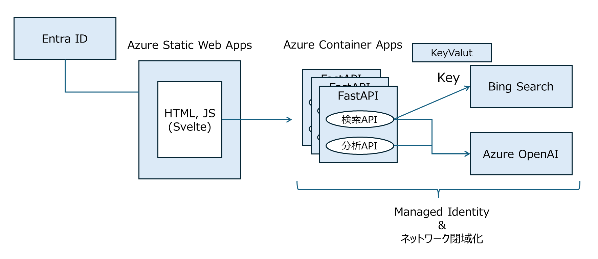

# YourWebCopilot

このプロジェクトは、Bing Web Search API v7とAzure OpenAI Serviceを活用したアプリケーションです。ユーザーが簡単に情報検索とAIによる高度な分析を行えるように設計されています。[こちら](https://qiita.com/shyamagu/items/98fe60f6f81b744b97b1)の記事で解説した”検索型"RAGのサンプル実装になります。


**このサービスではスクレイピングを実行します。対象のWebページがスクレイピングを禁止していないかなどは確認して利用ください。**

このプロジェクト構成としては以下の動作検証を目的とした環境を前提にしています。


もしより本番系を意識する場合は、本プロジェクトのフロントエンドとバックエンドを分けて以下のような構成が推奨です。




## 必要なサービス

- Bing Web Search API v7
- Azure OpenAI Service

## 必要な環境変数

このプロジェクトをローカルまたは本番環境で実行するには、以下の環境変数が必要です。

- `BING_API_KEY`: Bing Web Search APIのAPIキー
- `AOAI_API_KEY`: Azure OpenAI ServiceのAPIキー
- `AOAI_ENDPOINT`: Azure OpenAI Serviceのエンドポイント
- `AOAI_MODEL`: 使用するモデルのデプロイ名（モデルは`gpt-4-turbo`を推奨）

## 開発環境のセットアップ

### frontendフォルダ

フロントエンドの開発環境をセットアップするには、以下のコマンドを実行します。
```bash
npm install
```

そのうえで、開発サーバを起動します。
```bash
npm run dev -- --open
```

これにより、ローカルサーバが起動し、ブラウザが自動的に開きます。

もしビルドしたい場合は、以下のビルドコマンドを実行するとbackend側に成果物が配置されるため、backendのみの起動でも動作するようになります。
```bash
npm run build
```

### backendフォルダ

環境変数を.envとしてbackendフォルダに置きます。

バックエンドの開発環境をセットアップするには、Pythonの仮想環境をアクティベートし、以下のコマンドを実行します。
なお、仮想環境として.venvという名前を想定したスクリプトを用意してます。

事前準備
```bash
python -m venv .venv
activate.bat # Windowsの場合
pip install -r requirements.txt
```

開発サーバ起動
```bash
uvicorn main:app --reload
```

## 本番環境の準備

本番環境では、Azure App Serviceを使用します。以下の準備が必要です。

- Azure App Serviceの作成(Linux, python 3.11 コードベースで作成)
- 認証系（例：EasyAuth）の設定
- スタートアップスクリプト（`startup.sh`）の登録
- 環境変数`SCM_DO_BUILD_DURING_DEPLOYMENT`を`1`に設定
- BingとAOAIの環境変数を設定
- 発行プロファイルと名前を控える

詳細な手順については、[参考サイト](https://qiita.com/shyamagu/items/4fca59e47ae74b1ebaff)を参照してください。

## GitHub Actionsの設定

GitHub Actionsを使用して自動デプロイを設定する場合、以下の2つの変数をGitHubのSecretsに登録してください。

- `AZURE_WEBAPP_NAME`: Azure Web Appの名前
- `AZURE_WEBAPP_PUBLISH_PROFILE`: Azure Web Appの発行プロファイル

これにより、コードの変更がmainブランチにマージされるたびに、自動的に本番環境にデプロイされます。

## 注意事項

このプロジェクトのセットアップと実行には、`git fork`や`git clone`から始めることを前提としています。上記の手順に従って、必要なサービスと環境変数の設定を行ってください。